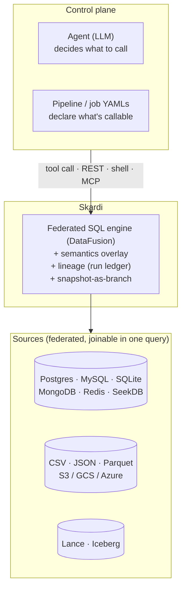

# Why everything goes through one engine

> Data autonomy is the point of an agent loop. Three primitives — semantics, lineage, snapshot-as-branch — are what keep autonomy from being reckless. They only compose at a chokepoint, and one engine in front of every source is that chokepoint.

## The thesis in one page

The whole point of an agent loop is that the agent picks the call. That includes which table to read, what query to run, whether to write back, and what rows to write. Take that away and the loop is just a routing layer in front of hand-written application code; the model is doing nothing the developer hasn't already done. **Data autonomy** — letting the agent decide what to query and what to write — is the thing the loop is actually for.

Autonomy is reckless without governance. An agent that picks its own SQL also picks the wrong table sometimes; misreads a column whose name is `status` but whose meaning is "Stripe webhook delivery state, not order state"; updates 1,000 rows you'd rather it hadn't. The naive response is to gate every action on a human, but that defeats autonomy and collapses the loop back into application code with extra latency. The right response is the same one databases reached for transactions and source control reached for branches: **bound the action without removing it.**

Skardi's bet is that three primitives are enough to bound it:

1. **Semantic overlay** — the agent reads what data *means*, not just its shape, before it writes any SQL.
2. **Lineage** — every action is attributable to who, what, when, and against which source, queryable from one ledger.
3. **Snapshot-as-branch** — destructive actions land in a branch the human reviews, with `git checkout`-like semantics for revert.

These primitives only compose at a chokepoint. With direct SDKs the agent talks to N stores through N libraries, and there is no single layer at which any one of these can be implemented — the semantic catalog fragments, the audit trail scatters across log files, and atomic snapshots across sources are unreachable. With one engine in front of everything there is one place to instrument all three.

That is what Skardi is. Federation, declarative SQL pipelines, REST + shell + (soon) MCP bindings — those are how the plane is *built*. Governance is what the plane is *for*.



---

## 1. Semantic overlay — the agent reads what data *means*

**Status: shipped.** YAML overlay loaded by the server at startup; merged response served on `GET /data_source`, which the thin CLI (`skardi schema`) and any other HTTP client read directly. See [docs/semantics.md](/docs/features/semantics).

The failure mode this primitive addresses is concrete. Hand an LLM a `CREATE TABLE` schema dump and it hallucinates column names that aren't there, picks the wrong one of two tables with similar shapes, treats `status` as if it were an order status when it's actually a webhook-delivery status. Schema is shape; the agent needs *meaning*. Stuffing meaning into prompt-engineered system messages doesn't scale across many tables and doesn't survive schema drift — it has to live next to the data, version-controlled with the source registration.

The overlay is a `kind: semantics` resource, parallel in shape to `kind: pipeline` and `kind: context`, with one entry per source:

```yaml
kind: semantics

metadata:
  name: basic-semantics
  version: 1.0.0

spec:
  sources:
    - name: products              # cross-references data_sources[].name
      description: "Product catalog with pricing/inventory. One row per SKU."
      columns:
        - name: id
          description: "Stable internal SKU; primary key."
        - name: price
          description: "Retail price in USD."
```

For [catalog-mode sources](/docs/features/catalog) — where one Postgres / MySQL / SQLite registration auto-discovers many inner tables — the `name` field also accepts a fully-qualified `catalog.schema.table` path, addressing one specific inner table:

```yaml
spec:
  sources:
    # 1-part: broad fallback for the whole `mydb` catalog.
    - name: mydb
      description: "Internal application DB"

    # 3-part: targets one specific inner table. Wins for mydb.public.users only;
    # the bare entry above continues to apply to every other inner table.
    - name: mydb.public.users
      description: "Auth + profile data, one row per registered account"
      columns:
        - name: id
          description: "User ID (auth.users.id)"
```

Names with anything other than 1 or 3 dot-separated segments are a hard error at startup; duplicate keys across files are a hard error too, so multiple semantics files can be auto-generated by separate skills without silently overwriting each other. Full rule table in [docs/semantics.md](/docs/features/semantics#composition-rules).

The merged view is what the agent actually consumes. It surfaces in two places:

- **`GET /data_source`** — the catalog endpoint that any agent client hits at startup. Each table includes its description and per-column descriptions inline next to the Arrow type. The shape:

  ```json
  {
    "name": "products", "type": "csv", "path": "data/products.csv",
    "tables": [{
      "name": "products",
      "description": "Product catalog with pricing/inventory. One row per SKU.",
      "schema": [
        { "name": "id",    "type": "Int64",   "description": "Stable internal SKU; primary key." },
        { "name": "price", "type": "Float64", "description": "Retail price in USD." }
      ]
    }]
  }
  ```

- **`skardi schema`** — the thin CLI's client for the same endpoint, rendering the merged view for human inspection during context authoring.

This is *the agent's prompt*. The catalog endpoint is the first thing a well-built reading agent calls in a session, and the descriptions there are what it reads before it decides which pipeline to invoke. The overlay is shipped today; an agent-callable `describe` verb (so the agent can pull a single table's overlay through a pipeline call rather than the catalog endpoint) is open on the roadmap (`6` — *agent-callable describe verb*).

One known limitation: the HTTP `/data_source` endpoint emits one table per source today, so qualified `catalog.schema.table` overlays for inner tables of a catalog-mode source don't yet surface there — and since `skardi schema` only renders that endpoint's response, they don't surface on the CLI either. Tracked in the same doc.

---

## 2. Lineage — every write attributable, every change debuggable

**Status: partial.** Async-job ledger shipped; sync-pipeline-write lineage and agent identity passthrough are open on the roadmap (`6` — *lineage capture*, *agent identity passthrough*).

The failure mode: an agent did something surprising last week. You want to know which agent, which session, which tool call, with which parameters, against which source, and what the result was. With direct SDKs that information lives in a different log file per integration — process logs in one place, ORM query logs in another, vector DB request logs in a third — and joining them across a single agent action is a forensic exercise. With one chokepoint, every action goes into one ledger.

### What's recorded today: the async-job ledger

Every async job submission creates one row in a SQLite ledger (default `~/.skardi/jobs.db`). The schema is fixed by `crates/skardi/src/jobs/store.rs` — the `INIT_SCHEMA_SQL` constant:

```sql
CREATE TABLE IF NOT EXISTS job_runs (
    id            TEXT PRIMARY KEY,    -- UUIDv4, hex-only
    job_name      TEXT NOT NULL,       -- metadata.name from the job YAML
    parameters    TEXT NOT NULL,       -- JSON of bound submit-time values
    status        TEXT NOT NULL,       -- pending → running → succeeded|failed|cancelled
    created_at    TEXT NOT NULL,
    started_at    TEXT,
    finished_at   TEXT,
    rows_written  INTEGER,             -- set on succeeded; also on post-commit cancels
    snapshot_id   TEXT,                -- Lance: the version the commit landed on
    error         TEXT                 -- non-null on failed/cancelled
);
```

Every submit appends a row; every lifecycle transition updates it. The submit-time pre-flight (parameter presence, type check, **destination schema diff** against the planned SELECT) runs *before* the row is inserted, so a malformed submit cannot pollute the ledger. On startup the server reconciles orphans — any row left in `pending` or `running` by a crashed previous process is rewritten to `failed` with `"server restarted before run completed"`, so the ledger never lies about what's still in flight.

That gives you, today, for any async write Skardi committed:

- the exact rendered query parameters (replayable by reading `parameters` and rerunning the YAML);
- the resulting Lance dataset version (`snapshot_id`) — the substrate for the snapshot-as-branch primitive below;
- a pre-write schema-diff guarantee (the destination's columns and types matched what the query produced, or the row was rejected before it ran);
- the row count and the error message on failure.

Full schema and lifecycle diagrams in [docs/jobs.md § Run ledger](/docs/jobs#the-run-ledger) and [§ Atomicity and failure modes](/docs/jobs#atomicity-and-failure-modes).

### What's not yet there

The async-job path is one of two write paths, and the ledger covers it only. Three gaps stand:

- **Sync-pipeline-write lineage.** Pipelines that issue `INSERT` / `UPDATE` / `DELETE` synchronously over `POST /<name>/execute` — the same shape as a read pipeline, but with a write SQL body — do not currently capture a ledger row. The pipeline handler in `crates/server/src/pipeline_handlers.rs` does not touch `JobStore`. Closing this means sync writes write a row with the same column shape (likely a unified `actions` ledger that subsumes `job_runs`).
- **Agent identity passthrough.** The ledger's `parameters` column captures *what* was bound, but no binding currently injects *who*. A first-class agent identity — `agent_id`, `session_id`, `tool_call_id`, `timestamp` exposed as SQL context vars pipelines can read and the runtime stamps onto every ledger row — is open on the roadmap. The target shape (per roadmap item `6` — "any binding injects client identity into a SQL context var pipelines can read") is that each binding pulls identity from its own native carrier and lifts it into the same context var: HTTP headers for REST, environment variables or CLI flags for shell, the MCP context object for MCP — though the per-binding details (header names, env var names, MCP context fields) are open design decisions. Until it lands, attributing an action to a specific agent run requires the caller to include that information as an explicit parameter.
- **Agent-callable lineage surface.** The ledger is queryable through `GET /jobs/runs` and the `skardi job list` CLI today, but those are operator surfaces, not agent verbs. The natural extension of roadmap item `6`'s *agent-callable `describe` verb* is a `skardi describe runs --since=… --by-agent=… --against=<source>` form, backed by a pipeline that joins the ledger against the semantic overlay so an agent can ask "which jobs touched `products` this week and what did they write" in one call rather than scraping `/jobs/runs` JSON.

The shape of the ledger we already have is the shape these gaps fill in against, not an extension of it — which is why this primitive is *partial* rather than *open*. Add the missing write path, add the missing identity columns, and the same row tells the same story for every action the agent took.

---

## 3. Snapshot-as-branch — destructive autonomy is reversible

**Status: in progress.** Lance dataset versions and atomic-commit semantics are shipped; branch-and-merge semantics on top of those versions are the next step. Roadmap item `6` — *snapshot-as-branch / agent checkpoints*.

The failure mode is the most concrete of the three. The agent updated 1,000 rows you don't like. Without something better, this is an incident — restore from backup, page the on-call, write a postmortem. With a branch, it's a `revert` call. Source control solved this exact problem for code thirty years ago; the answer for agent writes against a lake is the same primitive applied one layer down.

### What's true today

- **Lance destinations commit atomically per run.** A job streams its query output through the destination in batches, but the Lance manifest commit is the last step and runs only after the stream drains successfully. A crashed server, a SIGKILL'd process, a query error mid-stream, or a `skardi job cancel` that arrives before commit all leave the destination at its previous version, with no partial rows visible. Lance manifests handle the on-disk equivalent of `BEGIN…COMMIT` for free.
- **Lance dataset versions are the substrate.** Every successful job's `snapshot_id` is the Lance version the commit landed on. Lance keeps every version queryable until garbage-collected, so a "before / after" diff against a specific run is already mechanically possible — you have the version it landed on (from the ledger) and the version before that (Lance's parent pointer). The branch primitive is layered on top of this versioning, not built from scratch.
- **Submit-time pre-flight prevents schema drift on async writes.** Every job submit runs the destination schema diff before creating a ledger row, so an agent that produces a column the destination doesn't have can't even start a run.

This means even without explicit branches, the worst outcome of a bad async write today is "a Lance version you don't want, queryable side-by-side with the one you do, until the next commit replaces it." That is already a meaningfully better failure mode than corrupted Postgres tables, but it is not yet a workflow.

### Branch-as-checkpoint, the next step

The destination of this primitive: every agent write lands in a *branch*, the human reviews the diff against the trunk version, and merges or reverts. Borrowing the README's analogy directly, the workflow looks like:

```bash
# Agent submits a job that writes to a branch instead of trunk
skardi job run wiki-rewrite --param prefix='entity/turing-%' --branch=experiment/turing-rewrite

# Human reviews the diff between the branch and trunk
skardi branch diff experiment/turing-rewrite

# Either merge it in, or throw it away
skardi branch merge  experiment/turing-rewrite
skardi branch revert experiment/turing-rewrite
```

The pieces that remain to land for this to work: branches (named pointers above Lance versions), a branch-aware destination (so a job's `destination.table` resolves against a branch), a diff verb, and merge / revert. Iceberg destinations are also planned for the same primitive — Iceberg is read-only today on the source side; write support and its native branch / tag semantics are roadmap (`1` — Iceberg writes; `6` — snapshot-as-branch).

Be honest about where this sits: of the three primitives, this is the most aspirational. Lance versions are real today, but the workflow above does not exist yet. The rest of the doc treats it accordingly.

---

## Why a uniform plane is the architectural prerequisite

Each of the three primitives above has the same property: it works at *one* layer or it doesn't work. That is not aesthetic — it is what makes one uniform engine the architectural prerequisite, not just one of several reasonable shapes.

**Semantic overlay needs a single discovery surface.** N SDKs means N catalogs the agent has to learn about, each in its own dialect (SQL `INFORMATION_SCHEMA`, MongoDB collection lists, vector store index metadata, REST endpoint documentation). The agent has no place to find "the description of every table I can touch" because there is no "every." With one plane, `GET /data_source` is the single answer.

**Lineage needs a single write path.** N SDKs means N log conventions and no joinable trail — the Postgres slow-query log, the MongoDB profiler, the vector store request log, and the application-level wrapper log are all separate streams with separate keys. Joining them around a single agent action is forensic work, not a query. With one plane, every write is one row in one ledger; "show me everything that agent did between 2pm and 3pm" is a `WHERE` clause.

**Branching needs a single transactional layer.** N SDKs means no atomic cross-source snapshot — there is no "before this agent run" you can roll back to, because no SDK was watching all the SDKs. The unit a branch can wrap is the unit the chokepoint sees. With one plane, that unit is the agent's tool call; without one, it doesn't exist.

The Spark analogy is a one-paragraph note here, not the headline: Spark gave data teams one engine over every storage format with one query language, and that shape is what made the Databricks governance layer (Unity Catalog, lineage, Delta time-travel) possible at all. Skardi borrows that half of Spark's shape — one engine, one SQL, every source — and adds the governance layer the analytics workload Spark targets never needed (because nightly Airflow DAGs do not pick their own queries; agents do). The workload is different; the shape is the same.

[DataFusion](https://datafusion.apache.org/) is the in-process Rust SQL engine that makes this possible without a cluster. The plane is one Rust process plus a small SQLite file for the run ledger; deployment is "next to your data, behind your usual auth," not a multi-node spin-up.

On the "behind your usual auth" half: Skardi ships drop-in session auth via [better-auth](https://www.better-auth.com/) backed by SQLite (roadmap `7` — *session auth*), so every `/<pipeline>/execute` call is gated on a logged-in session and `auth.users` / `auth.sessions` are available as virtual tables a pipeline can `JOIN` against — see [docs/auth/](/docs/features/auth). What's *not* there yet is governance one layer in: per-pipeline grants, per-agent-identity grants, row-level policies. Today auth is at the server level — logged in or not — and finer-grained access (which agent identity is allowed to call which pipeline) is the natural next step on top of the lineage / identity-passthrough work in section 2, but is not yet a concrete roadmap item.

---

## What this is not

A few comparisons that sound similar but are deliberately off-mission:

- **Not "MCP server framework."** MCP is one binding among several (REST and shell are shipped; MCP is roadmap `5`). The product is the parameterized-SQL pipeline plus the three governance primitives above. If MCP gets replaced by a better protocol, the YAMLs still describe the right tools.
- **Not "another vector DB."** Skardi integrates pgvector, sqlite-vec, Lance KNN, and SeekDB HNSW — it does not ship a new ANN index. The primitive is "hybrid retrieval as SQL," joinable like any other relation, not yet another store.
- **Not "an agent framework."** No tool loop, no planner, no router. Bring your own agent. The plane only handles the data layer the agent's tool calls traverse.
- **Not "an LLM gateway."** Provider keys, cost accounting, and model routing live above the plane. An `llm()` UDF for inline model calls is on the longer-horizon roadmap, but the MVP deliberately stays out of the gateway business.

---

## Get involved

We're building in public. If the thesis above resonates — or if it doesn't — we want to hear it.

- **[Discord](https://discord.gg/S5YQQPEV2m)** — ongoing conversation, POC help, roadmap feedback.
- **[GitHub issues](https://github.com/SkardiLabs/skardi/issues)** — file against any unchecked roadmap item; we'll pair on design and review.
- **[skardi-skills](https://github.com/SkardiLabs/skardi-skills)** — a growing library of ready-to-use Skardi setups.

The full public roadmap (with live `[x]` / `[ ]` checkboxes for what's shipped vs. open) lives in the [main README](/docs/roadmap). The rest of this doc tree walks the concrete pieces:

- [Server](/docs/server) — the HTTP process that hosts both peer surfaces.
- [Pipelines](/docs/pipelines) — online serving (parameterized SQL as REST).
- [Jobs](/docs/jobs) — offline jobs (async batch writes to Lance or a DB).
- [CLI](/docs/cli) — the thin HTTP client: `skardi query`, `skardi run <pipeline>`, `skardi schema`, and friends.
- [Semantics](/docs/features/semantics) — the agent's discovery surface.
- [llm_wiki demo](/docs/demos/llm-wiki) — the fullest end-to-end demonstration of agent autonomy on Skardi.
